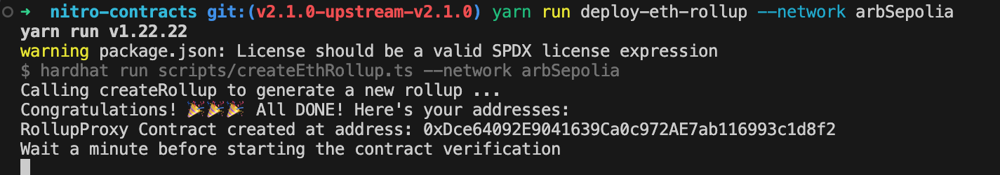

# Developer Feedback: Deploying Arbitrum Orbit with Avail DA

This feedback provides a detailed overview of my experience with the documentation for deploying Arbitrum Orbit with Avail DA. The guide I used is available [here](https://docs.availproject.org/docs/build-with-avail/Optimium/arbitrum-nitro/nitro-stack).

## Navigation Through the Documentation
### Starting Point Challenges
I began by opening the link [Deploy Arbitrum Orbit with Avail DA](https://docs.availproject.org/docs/build-with-avail/Optimium/arbitrum-nitro/nitro-stack) from EthGlobal partner section but decided to explore how easily this page could be found within the documentation. Navigating from the starting page felt confusing—it appeared more like user documentation with UI/UX elements, rather than technical developer documentation.

As a developer, I prefer a left-hand sidebar navigation. Without this, I felt lost and hesitant to proceed. While some decoration on the starting page is fine, the sidebar should remain accessible for efficient navigation.

### Exploring the Docs
To locate information on connecting Avail DA to rollups, I clicked "Interact with AvailDA" in the "Build on Avail DA!" section. However, this took me to the “Get Started with Interacting on Avail” page, which wasn't relevant to my purpose. Here is my surfing logic:

The buttons on this page are visually helpful and should remain the main focus, but the options (SDK, SubXt, GSRPC) weren’t relevant to me.
I checked the right-hand sidebar menu for rollup information but found only Avail-specific sections.
I then turned to the left-hand menu, where "Sovereign Rollups" caught my attention. However, the term "Sovereign" wasn’t intuitive in the context of rollups. Additionally, this article focused on specific rollups, not on Arbitrum Orbit.

### General Observations
The documentation mixes user and developer content, making it harder to navigate. Consider separate sections like "Developer Guide" and "End User Guide" for clarity.
Pages are lengthy, requiring unnecessary scrolling. Shorter articles with more submenus in the left-hand menu would improve usability.
The naming convention for rollups was confusing. For instance, new users might not associate "Optimium" with "Optimistic Rollups." Using clearer terms like "Optimistic Rollups" would help.
Locating "Arbitrum Orbit"
Eventually, I found "Arbitrum Nitro" under "Optimium." However, I expected a more direct label like "Arbitrum Orbit" in the left-hand menu for this guide. "Arbitrum Nitro" seemed overly specific, making it unclear if this was the correct section.

I appreciated the buttons within the [Arbitrum Nitro Stack section](https://docs.availproject.org/docs/build-with-avail/Optimium/arbitrum-nitro), but it would be more user-friendly to have Arbitrum Nitro overview directly accessible here without additional navigation to an Overview page.

## Prerequisites
### Purpose and Clarity
The guide begins with a clear purpose, which I found helpful for understanding its relevance.

### Docker Requirements
I already had Docker installed, but there was no mention of the required version or how to verify its installation via CLI. Including this information would improve accessibility.

### Avail Prerequisites
- The link labeled "our docs here" is vague. It should explicitly reference actions like "Create an Avail Account" or "Get Avail Testnet Tokens".
- These actions should be split into separate sections, e.g.,
   - Creating an Avail Account
   - Getting Testnet Tokens
Additionally, the guide didn’t clarify whether Avail testnet tokens were required.

### Creating an Avail Account

This section could be restructured as:

"Two Ways to Create an Account"

- Using a compatible wallet (link to wallet instructions)

- Using the Explorer (link to Explorer instructions)

### Screenshots

The screenshots in the guide were overly large, requiring scrolling. Use smaller images or pixelated filters to hide sensitive data instead of red markers. The inconsistency between hidden and visible sensitive data across screenshots was also distracting.

### Issues and Suggestions

- Typographical errors in steps 3 and 6 need fixing.
- The instructions for creating an account using Subwallet worked fine but could simply link to Subwallet’s documentation, which is already clear and well-maintained.
- There’s no instruction for creating an account via the Explorer.

### Registering AppID

#### Observations

The style of this page differs from the others, which could be standardized for consistency.
The purpose of checking the next available AppID wasn’t clear. I expected an auto-generate button for AppIDs, rather than having to check and register one manually.

#### Suggestions

- Rename the page to "AppID Management" and organize it into:
   - "Generate AppID"
   - "Check AppID"
   - "Register AppID"

- Reverse the order of AppIDs (latest first) for better visibility, similar to transaction explorers.

## Deploying Rollup Contracts

The deployment process was successful, and I was able to complete the required steps without major issues.

### Clarity on Avail Nitro Contracts
Include a brief explanation of Avail Nitro Contracts and their relevance to the deployment process, especially for newcomers.

### Missing Prerequisites
Foundry, a required tool for contract deployment, wasn’t listed in the prerequisites. This oversight caused delays.

### Unclear Objectives
The deployment process lacked an overview of what would be achieved. A clear plan at the beginning of the guide would provide better context.

## Orbit Setup Script
### Config Files
- Provide sample config files with filled-out fields to help users understand the required parameters.
- The guide should mention that parameter descriptions are available in the orbit-setup-script documentation.
### Additional References
Include links to Arbitrum’s documentation:

- [Orbit Quickstart Guide](https://docs.arbitrum.io/launch-orbit-chain/orbit-quickstart#step-3-configure-your-orbit-chains-deployment)
- [Customization Options](https://docs.arbitrum.io/launch-orbit-chain/how-tos/customize-deployment-configuration).

### Issues and Suggestions
Field "upgradeExecutor" was unnecessary for my use case (Arbitrum Rollup Chain), it's the AnyTrust Chain config field. These should be clarified or excluded in context because I don't have it.
The documentation contains several typos and missing descriptions for certain parameters.

## Conclusion
The documentation demonstrates significant effort but requires adjustments for smoother usability:

- Improve navigation with a consistent sidebar and shorter, focused articles.
- Clarify terminology and prerequisites for developers, especially those new to Avail and Arbitrum.
- Add troubleshooting guidance and context for each step.

I hope this feedback helps the team refine the documentation for a better developer experience.
